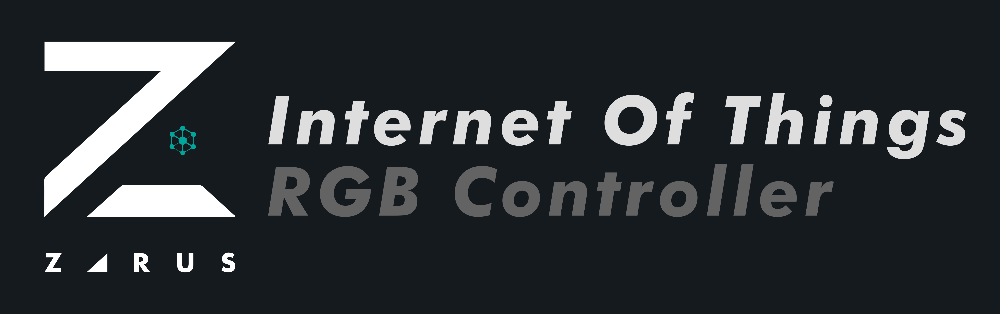
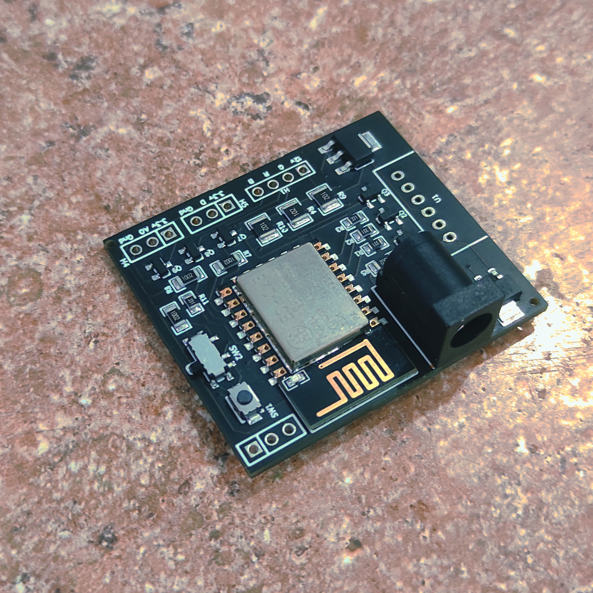
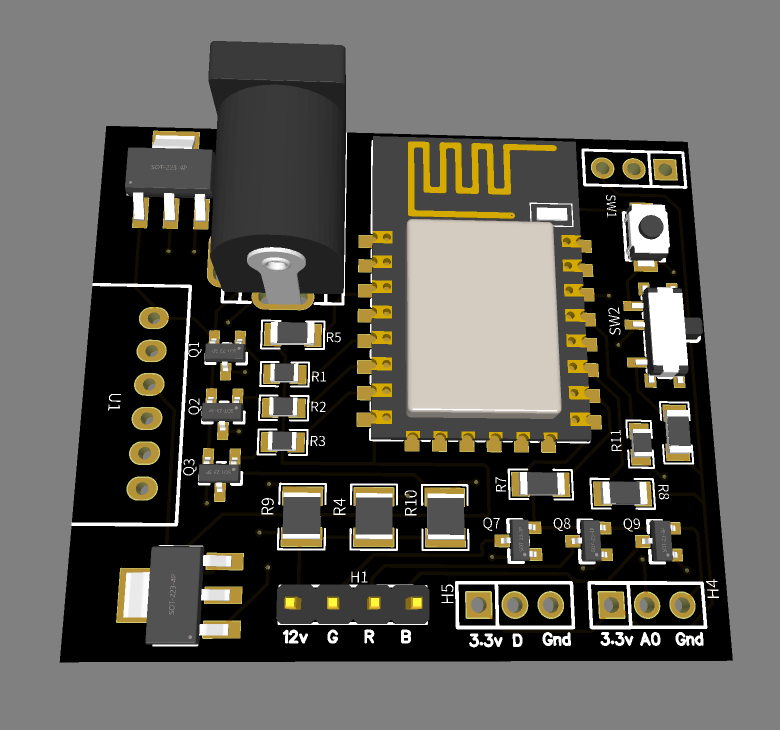
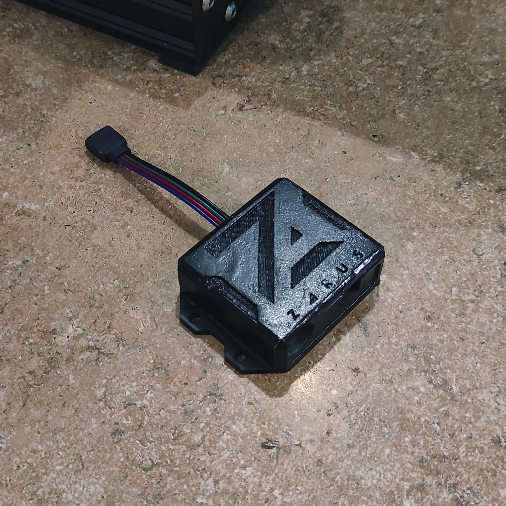

# RGB Strip Controller for ESP8266 and ESP32
Control your rgb lights from your cell phone, using a website, an mqtt broker, or even the same remote control that came with the lights

Look at the [Zarus IoT Hub](https://github.com/AndresDuran53/zarus-iot-app) to get an easy way to connect to the devices without an IP.

## Quick Start
### Using Zarus IoT Hub application (Android only)
1. Download the Zarus IoT Hub application and open it.
2. Go to the *Devices* tab and click on *Find new device*.
3. Click on the device that you want to configure and wait until your phone connects.
4. Insert the name and password of your Home Wi-Fi, and click *Save configuration*.
5. Connect your phone again to your Home Wi-Fi and click *Refresh*.
6. Click *Scan network* and click the device that you want to add.
7. Now you can go to the *Home* tab and click the device to start using you new device.

For more information go to [Zarus IoT Hub](https://github.com/AndresDuran53/zarus-iot-app)

### Manually using a browser (IOS - Android - PC)
1. Go to your Wi-Fi configuration and look for a network named like: "rgb-light-xxxxxx"
2. Connect to that network with the password: *password123*
3. Open a browser (Google Chrome, Firefox, etc...) and go to *http://192.168.4.1*
4. On the WebPage click on *Settings* and *Device Settings*
5. Insert the SSID (name) and password of your Wi-Fi which you want the device be connected to, and click *Save/Guardar*.
6. Disconnect from the device network and connect to your Wi-Fi
7. You have to find which IP your device has in your network, you can use different applications for that.
8. Now that you have the IP of your device you just have to put that IP into the browser and you are going to be able to control the device.

## Create yours from scratch

### PCB creation
You can find the Gerber, BOM, and PickAndPlace files in the [PCB/RGB-Controller](PCB/RGB-Controller) folder, to create your own PCB. Also you can import the hole folder into [EasyEDA](https://easyeda.com/es) to modify it yourself.

You only need to add a cable to connect to the RGB Leds (5050 Strip or NeoPixel, respective paths), and the InfraRed transistor if you wanted.

### 3D Printing
In the folder [3D Desing](3D%20Desing) you can find the .stl file to print in any 3D printer and also a .FCStd file that you can use to modify the model using [Freecad](https://www.freecadweb.org/). Or if you wanted you can use the .gcode to just import to a printer.

#### Parameters used for gcode
* Printer: Ender 3 Pro
* Material: PETG
* Heat Bed: Yes

### Compile using Arduino
1. Download the firmware in [RGB-Strip-Firmware](RGB-Strip-Firmware).
2. Open it in the Arduino IDE.
3. Import the libraries.
4. Upload the sketch.

#### Libraries and tools needed
Tools for upload files into the ESP device:
* ESP8266: [ESP8266fs](https://github.com/esp8266/arduino-esp8266fs-plugin/releases) | ESP32: [ESP32FS](https://github.com/me-no-dev/arduino-esp32fs-plugin/releases)

Libraries:
* [Network Controller](https://github.com/AndresDuran53/zarus-network-controller/)
* [IRremoteESP8266](https://github.com/crankyoldgit/IRremoteESP8266)

## TO-DO
- [ ] Check the IRremote library for ESP32

## License
Zarus RGB Controller is an open source code. All files are licenced under Creative Commons [Reconocimiento-NoComercial-CompartirIgual 4.0 Internacional](https://creativecommons.org/licenses/by-nc-sa/4.0/deed.es)
